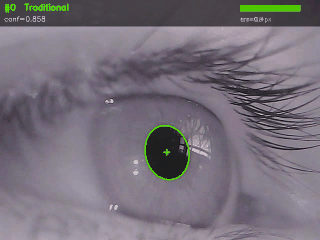

# Confidence-Guided Fallback (CGF) — Real-Time Pupil Detection

[](https://opensource.org/licenses/MIT)

**CGF** is a real-time pupil detection framework that fuses traditional binarization with deep segmentation through a geometric confidence scoring mechanism. It achieves near deep-learning accuracy at significantly higher throughput by invoking the deep model *only when needed*.



> Green overlays = traditional detection (high confidence).  
> Red overlays = RITNet fallback triggered by low confidence.  
> The confidence bar (top-right) shows the per-frame geometric confidence score against threshold τ.

## Key Idea

```
Input Frame → Adaptive Mean → Confidence Score → [s ≥ τ?]
                                                    ├─ Yes → Traditional center (fast)
                                                    └─ No  → RITNet segmentation (robust)
```

- **Traditional front-end**: Adaptive Mean thresholding (~570 FPS) handles ~78% of frames
- **Geometric confidence**: 4 factors (circularity, aspect ratio, area consistency, convex-hull ratio) combined with AUROC-guided weights (combined AUROC = 0.961)
- **RITNet fallback**: Fine-tuned DenseNet encoder-decoder (~200 FPS) handles only difficult frames
- **Result**: ~301 FPS estimated throughput with 86.8% within-5px accuracy on LPW

## Performance on LPW (130,856 frames)

| Method | Median Error (px) | Within 5px (%) | Detection Rate | Est. FPS |
|---|---|---|---|---|
| Pure Traditional (Adaptive Mean) | 3.10 | 55.7 | 99.2% | 566 |
| **CGF (τ=0.8)** | **1.40** | **86.8** | 74.8% | **301** |
| Pure RITNet | 1.68 | 83.6 | 60.3% | 200 |

## Installation

```bash
pip install -r requirements.txt
```

**Requirements**: Python ≥ 3.7, OpenCV ≥ 4.5, PyTorch ≥ 1.9

### Model Weights

Download the fine-tuned RITNet weights (`best_model_finetune_v2_ep122_miou9524.pkl`) and place it in this directory, or pass the path via `--weights` / `weights_path=`.

> The model was fine-tuned on s-OpenEDS random crops (OpenEDS validation mIoU ≈ 0.95).

## Quick Start

### Python API

```python
from cgf_detector import CGFDetector
import cv2

detector = CGFDetector(weights_path="best_model_finetune_v2_ep122_miou9524.pkl", threshold=0.8)
gray = cv2.imread("frame.png", cv2.IMREAD_GRAYSCALE)
result = detector.detect(gray)

print(f"Center: {result['center']}")       # (cx, cy)
print(f"Method: {result['method']}")       # "traditional" or "RITNet"
print(f"Confidence: {result['confidence']:.3f}")
```

### Generate Demo MP4

```bash
# Using LPW dataset path
python demo.py --lpw-dir /path/to/LPW --participant 1 --vid-id 1 \
    --weights best_model_finetune_v2_ep122_miou9524.pkl \
    --threshold 0.7 --frames 150 --output demo.mp4

# Using direct video path
python demo.py --video /path/to/LPW/1/1.avi \
    --weights best_model_finetune_v2_ep122_miou9524.pkl \
    --threshold 0.7 --frames 150 --output demo.mp4
```

### Threshold Modes

| Mode | τ | Use Case | Key Metrics |
|---|---|---|---|
| Accuracy | 0.8 | Single-frame center localization | Median err 1.40 px; 86.8% <5px; ~301 FPS |
| Stability | 0.7 | High detection rate / temporal stability | Det rate 89.0%; ~406 FPS |

## Project Structure

```
├── cgf_detector.py      # Main CGF detector class (entry point)
├── confidence_score.py  # Geometric confidence scoring (4 factors)
├── traditional_methods.py  # 5 traditional binarization methods
├── ritnet_inference.py  # RITNet inference wrapper
├── densenet.py          # DenseNet2D encoder-decoder architecture
├── pupil_geometry.py    # Ellipse fitting & geometric priors
├── metrics.py           # Evaluation metrics (IoU, center error)
├── config.py            # Configuration parameters
├── demo.py              # Demo script: generate visualization MP4
├── requirements.txt     # Python dependencies
└── README.md
```

## Confidence Factors

| Factor | AUROC | Weight | What it detects |
|---|---|---|---|
| Convex-hull ratio | 0.944 | 0.50 | Fragmentation, occlusion cuts |
| Circularity | 0.904 | 0.30 | Non-circular noise blobs |
| Area consistency | 0.861 | 0.10 | Too-small noise or too-large iris |
| Aspect ratio | 0.677 | 0.10 | Elongated false detections |
| **Combined** | **0.961** | — | Complementary shape quality |

## Citation

If you use this code, please cite:

```bibtex
@article{cgf2026,
  title={Confidence-Guided Fallback Strategy: Real-Time Pupil Detection Combining Traditional Binarization and Deep Segmentation},
  author={Author A and Author B},
  journal={Applied Sciences},
  year={2026}
}
```

## License

MIT
